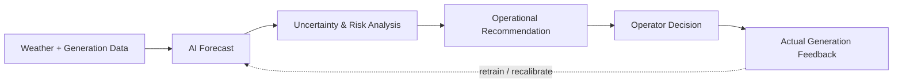
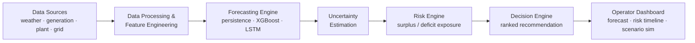

<div align="center">

# IntelliGen

### We don't forecast sunshine. We forecast what it costs the grid.

**AI-Powered Renewable Generation Forecasting Platform**
*From Renewable Uncertainty to Actionable Grid Intelligence*

[](#)
[](#)
[](#)

[**Live Pitch Page**](https://claude.ai/code/artifact/c9c48696-9538-4703-b725-3f54d5ccd609) · [Backend](./backend) · [Frontend](./frontend) · [ML Pipeline](./ml)

</div>

---

## The one-line pitch

Renewable forecasting is a crowded problem — plenty of teams will show you a curve that predicts megawatts. **IntelliGen predicts the operational risk that curve creates, and tells the operator what to do about it, before it happens.** Forecast → Risk → Recommendation, not forecast alone.

## Table of Contents

- [Why This, Not Another Forecasting Dashboard](#why-this-not-another-forecasting-dashboard)
- [The Problem](#the-problem)
- [How It Works](#how-it-works)
- [Architecture](#architecture)
- [Repository Structure](#repository-structure)
- [Risk Categories](#risk-categories)
- [MVP Scope](#mvp-scope)
- [Mapped to What Judges Actually Score](#mapped-to-what-judges-actually-score)
- [Quickstart](#quickstart)
- [Roadmap](#roadmap)
- [Design Boundary](#design-boundary)
- [Team](#team)

## Why This, Not Another Forecasting Dashboard

Most submissions to this theme will converge on the same shape: ingest weather data, train a model, plot predicted vs. actual generation. That's a forecasting exercise, not a grid-operations tool — and it's also, statistically, what most of the other 200 teams will build. Here's the layer we add on top of it:

| What a typical forecasting submission ships | What IntelliGen ships |
|---|---|
| A single predicted value ("600 MW at 16:00") | A predicted value **+ a calibrated uncertainty band** ("600 MW, plausible range 520–680 MW") |
| A chart of predicted vs. actual generation | A chart that also plots **demand, and shades where generation and demand diverge** |
| A generic high/low generation alert | A **risk score computed from forecast uncertainty *and* available flexibility** — the same 100 MW error is LOW risk with 500 MW of spare battery and CRITICAL with 50 MW |
| "Here's our forecast" | "Here's our forecast, here's *why* the risk changed, and here's the ranked sequence of actions to prepare for it" |
| A static demo | A **live scenario simulator** — drop solar 30% in front of the judges and watch risk, storage requirement, and backup need recompute in real time |
| Accuracy (MAE/RMSE) as the only metric | Forecast quality **+ uncertainty calibration + surplus/deficit detection accuracy + false-alert rate** |

The differentiator isn't a better model — it's refusing to stop at the model. See it live: **[the pitch page](https://claude.ai/code/artifact/c9c48696-9538-4703-b725-3f54d5ccd609)** walks through the gap, the loop, a mock operator screen, and the what-if simulator in about 60 seconds.

## The Problem

Renewable output doesn't fail to be predictable — it fails to be *prepared for*. A solar plant can swing from 950 MW to 300 MW in a few hours; the question that matters to a grid operator isn't "how much capacity is installed" but **"how much will actually be available, how sure are we, and what do we do if we're wrong?"**

- **Surplus** — generation exceeds demand + storage + export capacity → curtailment (clean energy thrown away)
- **Deficit** — generation falls short of demand and available flexibility → last-minute, often carbon-intensive, backup dependence
- **Uncertainty** — a point forecast hides how wrong it might be, which is exactly the information an operator needs to size a response

## How It Works



Three engines, three questions:

| Layer | Question it answers | What it does |
|---|---|---|
| **Forecast** | What is likely to happen? | Persistence baseline → XGBoost (quantile regression for the uncertainty band) → LSTM/ensemble only if validation earns it |
| **Risk** | How serious could it get? | Compares forecast + uncertainty against demand, battery SoC, export limits, backup capacity → LOW / MEDIUM / HIGH / CRITICAL |
| **Decision** | What should we do about it? | Ranked, explainable action sequence — charge → export → shift load → curtail (surplus); discharge → backup → escalate (deficit) |

## Architecture



## Repository Structure

```
IntelliGen/
├── backend/    # Python API — serves forecasts, risk & decision engines, scenario simulation
├── frontend/   # React dashboard + landing/pitch page
├── ml/         # Training pipeline — data processing, features, persistence/XGBoost models
└── README.md
```

## Risk Categories

| Level | Meaning | Action |
|---|---|---|
| 🟢 LOW | Forecast range comfortably within available flexibility | Continue monitoring |
| 🟡 MEDIUM | Forecast approaching an operational constraint | Prepare flexibility |
| 🟠 HIGH | Forecast range overlaps a meaningful surplus/deficit | Pre-position resources |
| 🔴 CRITICAL | Expected condition exceeds available flexibility | Escalate to authorized operators |

## MVP Scope

Ambitious in intelligence, disciplined in engineering — the goal is to prove the loop, not build a national grid platform in a weekend.

- **Renewable source:** Solar first (wind after the core architecture is validated)
- **Forecast horizon:** 24–72 hours
- **Models:** Persistence baseline → XGBoost (primary) → LSTM only if it beats XGBoost on validation
- **Data:** Public/historical generation + weather datasets/APIs; demand, storage, and export constraints are simulated and **explicitly labelled as such**
- **No** Kubernetes, microservices, blockchain, custom IoT/satellite hardware, or autonomous control — none of it moves the needle on forecast quality, risk detection, or operator decisions

## Mapped to What Judges Actually Score

| Criterion | Where IntelliGen delivers |
|---|---|
| **Innovation** | Full forecast → risk → decision loop, not an isolated prediction model |
| **Technical depth** | Quantile XGBoost for calibrated intervals, separable forecast/risk/decision engines, a real repo with backend + ml + frontend, not slides |
| **Feasibility** | Solar-only, 24–72h MVP on public data; every feature justified against "does it improve forecast, risk detection, or the operator's decision?" |
| **Impact** | Less curtailment, less fossil backup dependence, better storage utilization, more predictable renewable integration |
| **Presentation** | A live, interactive pitch page and scenario simulator a judge can drive themselves — not a static deck |

## Quickstart

**Backend**
```bash
cd backend
python -m venv venv && source venv/bin/activate
pip install -r requirements.txt
uvicorn app.main:app --reload
```

**ML pipeline**
```bash
cd ml
python -m venv venv && source venv/bin/activate
pip install -r requirements.txt
python -m src.train --data data/raw/solar_generation.csv --capacity 1000
```

**Frontend**
```bash
cd frontend
npm install
npm run dev
```

## Roadmap

Multi-plant and regional forecasting → higher-resolution/satellite weather data → energy-market price integration → automated integration with existing EMS under authorized safety controls → a digital-twin grid simulator for stress-testing operational strategy.

## Design Boundary

IntelliGen is a **decision-support system, not an autonomous grid controller.** It never touches generators, batteries, or grid infrastructure directly — it forecasts, quantifies risk, and recommends. Final operational decisions stay with authorized operators. This boundary is deliberate: it's what makes the system trustworthy enough to actually deploy.

## Team

**IntelliGen** — HACKOUT '26 Ideation Submission, Theme: Renewable Energy Intelligence
